<h2>TensorFlow-FlexUNet-Image-Segmentation-Mendeley-Glioblastoma-Multiforme-MRI (2026/04/23)</h2>
Sarah T. Arai 
Software Laboratory antillia.com  
This is the first experiment of Image Segmentation for <b>Mendeley-Glioblastoma-Multiforme-MRI</b> based on 
our <a href="./src/TensorFlowFlexUNet.py">TensorFlowFlexUNet</a>
 (<b>TensorFlow Flexible UNet Image Segmentation Model for Multiclass</b>), and a 512x512 pixels PNG
 <a href="https://drive.google.com/file/d/1Z-K5dIRw0TZ7TW1NAEKpL6qflLuMkqzz/view?usp=sharing">
Mendeley-Glioblastoma-Multiforme-ImageMask-Dataset.zip</a> with colorized masks 
(<a href="https://creativecommons.org/licenses/by/4.0/">
CC BY 4.0</a>), which was derived by us from   
<a href="https://data.mendeley.com/datasets/mxsb7snyvx/2">
Glioblastoma Multiforme Brain MRI Dataset for Tumor Detection and Classification
</a> on the mendeley.com
  

<b>Actual Image Segmentation for Glioblastoma-Multiforme Images of 512x512 pixels</b> 
As shown below, the inferred masks predicted by our segmentation model trained by the dataset appear similar to the 
ground truth masks, but they lack precision in certain areas.
  
<b>class_color_map = {NCR (Necrotic Tumor Core):red, ED (Edema):green, ET (Enhancing Tumor):blue}</b>
  
<table>
<tr>
<th>Input: image</th>
<th>Mask (ground_truth)</th>
<th>Prediction: inferred_mask</th>
</tr>
<tr>
<td>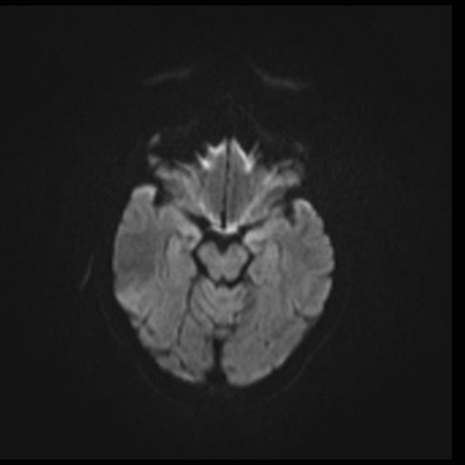</td>
<td>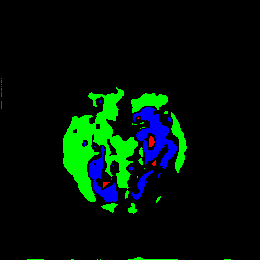</td>
<td>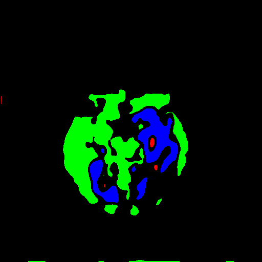</td>
</tr>

<tr>
<td>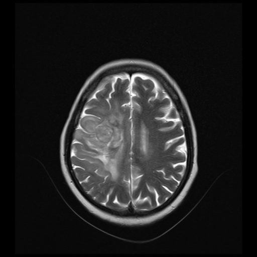</td>
<td>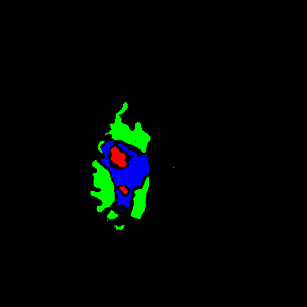</td>
<td>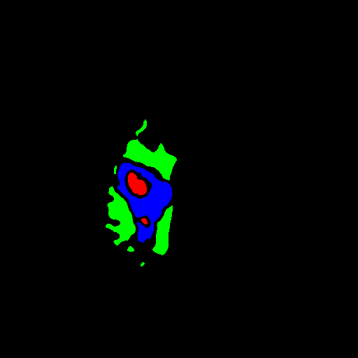</td>
</tr>

<tr>
<td>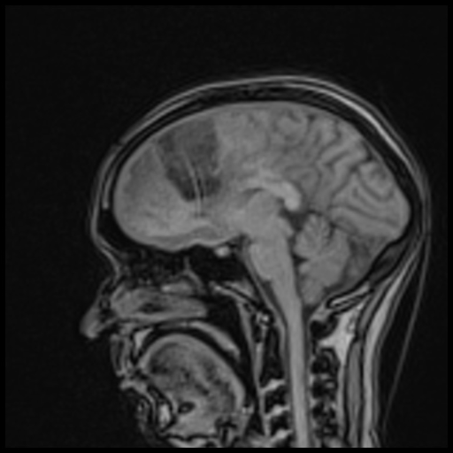</td>
<td>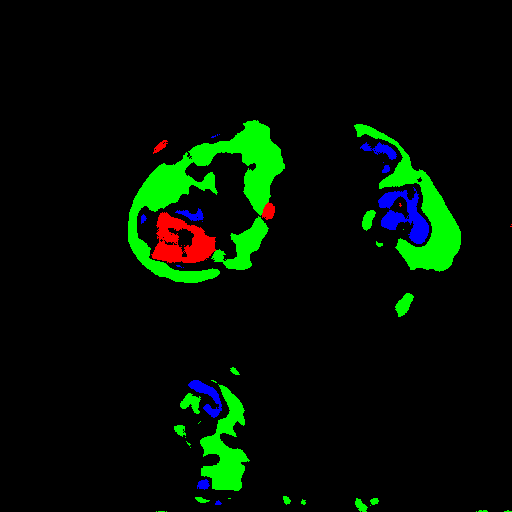</td>
<td>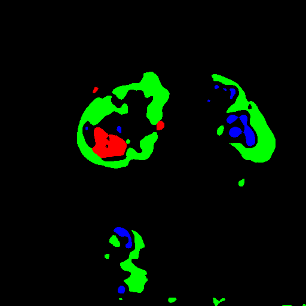</td>
</tr>
</table>

 
<h3>1. Dataset Citation</h3>
The image dataset used here was taken from   
<a href="https://data.mendeley.com/datasets/mxsb7snyvx/2">
Glioblastoma Multiforme Brain MRI Dataset for Tumor Detection and Classification
</a> on the mendeley.com
  
The following explanation was taken from the above mendeley web site.
  
<b>Description</b> 
The dataset consists of MRI brain scans of healthy subjects and patients diagnosed with Glioblastoma, collected from JK CT Scan & Research Centre, Jammu – 180003, India, during the period 2 March 2023 to 10 March 2024.
  
The data collection process was carried out under the supervision and clinical guidance of Dr. Sahil Gupta, Consultant Radiologist and Director at JK CT Scan & Research Centre. Dr. Gupta facilitated access to the MRI scans, ensured clinical correctness of diagnoses, and verified that all scans were acquired following standard radiological protocols.
  
All MRI data were fully anonymized prior to being handed over for research use. No personally identifiable information (PII) such as patient names, registration numbers, or demographic identifiers was included in the dataset. The data were provided strictly for academic and non-commercial research purposes, in compliance with ethical standards and patient confidentiality norms.
 
 
<b>Citation</b> 
Singh, Kuljeet; Malhotra, Deepti; Gupta, Sahil  (2026),  
“Glioblastoma Multiforme Brain MRI Dataset for Tumor Detection and Classification”,  
Mendeley Data, V2, doi: 10.17632/mxsb7snyvx.2
  
<b>License</b> 
<a href="https://creativecommons.org/licenses/by/4.0/">
CC BY 4.0</a>
 
 
<h3>2 Mendeley-Glioblastoma-Multiforme ImageMask Dataset</h3>
<h3>2.1 Download Mendeley-Glioblastoma-Multiforme Dataset</h3>
 If you would like to train this Mendeley-Glioblastoma-Multiforme Segmentation model by yourself,
 please download the dataset from the google drive our downscaled 
 <a href="https://drive.google.com/file/d/1Z-K5dIRw0TZ7TW1NAEKpL6qflLuMkqzz/view?usp=sharing">
Mendeley-Glioblastoma-Multiforme-ImageMask-Dataset.zip</a> .zip</a> 
(<a href="https://creativecommons.org/licenses/by/4.0/">CC BY 4.0</a>)) 
, expand the downloaded ImageMaskDataset and put it under <b>./dataset</b> folder to be:
 
<pre>
./dataset
└─Mendeley-Glioblastoma-Multiforme
    ├─test
    │   ├─images
    │   └─masks
    ├─train
    │   ├─images
    │   └─masks
    └─valid
        ├─images
        └─masks
</pre>
 
<b>Mendeley-Glioblastoma-Multiforme Statistics</b> 
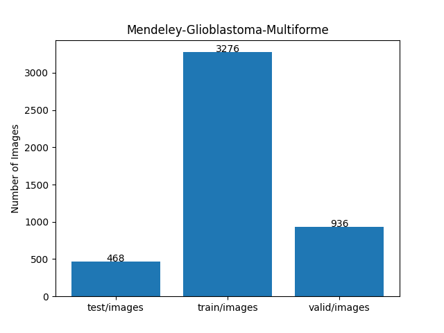 
  
As shown above, the number of images of train and valid datasets is large enough to use for the
 training set of our segmentation model.
  
<h4>2.2 Derivation of 512x512 pixels ImageMask Dataset</h4>
The folder structure of <b>Glioblastoma Multiforme Brain MRI Dataset for Tumor</b> is the following, which
contains 936 JPG images files, but no corresponding annotation files. 
<pre>
./Glioblastoma Multiforme Brain MRI Dataset for Tumor
└─Glioblastoma
     ├─00D5A20C.jpg
     ├─00D5A824.jpg  
...
     └─00499695.jpg
</pre>
<b>Original Glioblastoma Sample Images</b> 
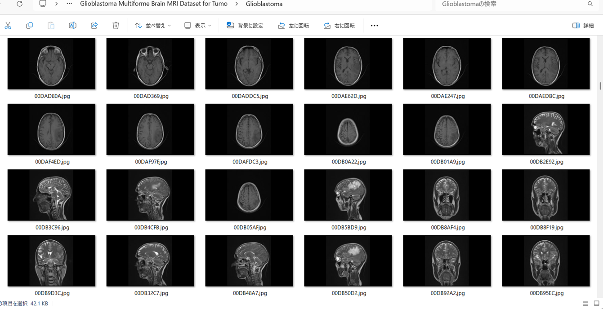  
<b>Step 1</b> 
We generated a 512x512 pixels PNG master <b>Glioblastoma Multiforme image and annotation (mask)</b> dataset by applying a
segmentation (inference) method of a pretrained Glioma TensorFlowFlexUNet model 
<a href="https://github.com/sarah-antillia/TensorFlow-FlexUNet-Image-Segmentation-UTSW-Glioma-T2W-Subset">
TensorFlow-FlexUNet-Image-Segmentation-UTSW-Glioma-T2W-Subset
</a> to the Glioblastoma images, without human annotation experts.  
We also used the following class color mapping table for Glioma three classes.  
<table border="1" style="border-collapse: collapse;">
<tr><th>Index</th><th>Category</th><th>Color </th><th>RGB triplet</th></tr>
<tr>
<td>1</td><td>NCR(Necrotic Tumor Core)</td><td>red</td><td>(255,0,0)</td>
</tr>
<tr>
<td>2</td><td>ED (Peritumoral Edema)</td><td>green</td><td>(0,255,0)</td>
</tr>
<tr>
<td>3</td><td>ET (Enhancing Tumor)</td><td>blue</td><td>(0,0,255)</td>
</tr>
</table>
  
<b>Step 2</b> 
We generated an augmented PNG ImageMask Dataset from the master dataset by using 
<a href="https://github.com/sarah-antillia/Image-Deformation-Tool">Image Deformation Tool</a> and 
<a href="https://github.com/sarah-antillia/Image-Distortion-Tool">Image Distortion tool</a>.  

<h3>2.3 Train Sample Images and Masks</h3>
<b>Train sample images</b> 
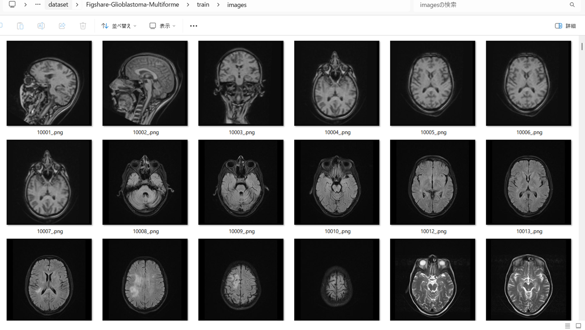
 
<b>Train sample masks</b> 
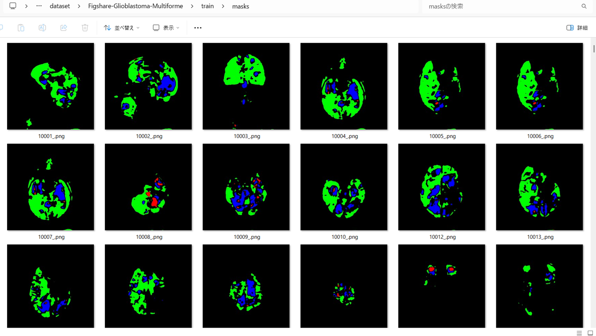
 
<h3>3 Train TensorFlowFlexUNet Model</h3>
 We trained Mendeley-Glioblastoma-Multiforme TensorFlowFlexUNet Model by using the 
<a href="./projects/TensorFlowFlexUNet/Mendeley-Glioblastoma-Multiforme/train_eval_infer.config"> <b>train_eval_infer.config</b></a> file.  
Please move to ./projects/TensorFlowFlexUNet/Mendeley-Glioblastoma-Multiforme and run the following bat file. 
<pre>
>1.train.bat
</pre>
, which simply runs the following command. 
<pre>
>python ../../../src/TensorFlowFlexUNetTrainer.py ./train_eval_infer.config
</pre>

<b>Model parameters</b> 
Defined a small <b>base_filters = 16 </b> and large <b>base_kernels = (11,11)</b> for the first Conv Layer of Encoder Block of 
<a href="./src/TensorFlowFlexUNet.py">TensorFlowFlexUNet.py</a> 
and a large num_layers (including a bridge between Encoder and Decoder Blocks).
<pre>
[model]
;You may specify your own UNet class derived from our TensorFlowFlexModel
model         = "TensorFlowFlexUNet"
image_width    = 512
image_height   = 512
image_channels = 3
input_normalize = True
normalization  = False
num_classes    = 4
base_filters   = 16
base_kernels   = (11,11)
num_layers     = 8
dropout_rate   = 0.05
dilation       = (1,1)
</pre>
<b>Learning rate</b> 
Defined a small learning rate.  
<pre>
[model]
learning_rate  = 0.00007
</pre>
<b>Loss and metrics functions</b> 
Specified "categorical_crossentropy" and <a href="./src/dice_coef_multiclass.py">"dice_coef_multiclass"</a>. 
<pre>
[model]
loss           = "categorical_crossentropy"
metrics        = ["dice_coef_multiclass"]
</pre>
<b>Dataset class</b> 
Specifed <a href="./src/ImageCategorizedMaskDataset.py">ImageCategorizedMaskDataset</a> class. 
<pre>
[dataset]
class_name    = "ImageCategorizedMaskDataset"
</pre>
 
<b>Learning rate reducer callback</b> 
Enabled learing_rate_reducer callback, and a small reducer_patience.
<pre> 
[train]
learning_rate_reducer = True
reducer_factor     = 0.5
reducer_patience   = 5
</pre>
<b>Early stopping callback</b> 
Enabled early stopping callback with patience parameter.
<pre>
[train]
patience      = 10
</pre>
<b>RGB Color map</b> 
Specifed rgb color map dict for Mendeley-Glioblastoma-Multiforme 1+3 classes. 
<pre>
[mask]
mask_datatyoe    = "categorized"
mask_file_format = ".png"
;Mendeley-Glioblastoma-Multiforme rgb color map dict for 1+3 classes.
rgb_map = {(0,0,0):0, (255,0,0):1, (0,255,0):2, (0,0,255):3,}
</pre>
<b>Epoch change inference callback</b> 
Enabled <a href="./src/EpochChangeInferencer.py">epoch_change_infer callback</a></b>. 
<pre>
[train]
epoch_change_infer       = True
epoch_change_infer_dir   =  "./epoch_change_infer"
num_infer_images         = 6
</pre>
By using this callback, on every epoch_change, the inference procedure can be called
 for 6 images in <b>mini_test</b> folder. This will help you confirm how the predicted mask changes 
 at each epoch during your training process.  
  
As shown below, early in the model training, the predicted masks from our UNet segmentation model showed 
discouraging results. However, as training progressed through the epochs, the predictions gradually improved. 
   
<b>Epoch_change_inference output at starting (epoch 1,2,3)</b> 
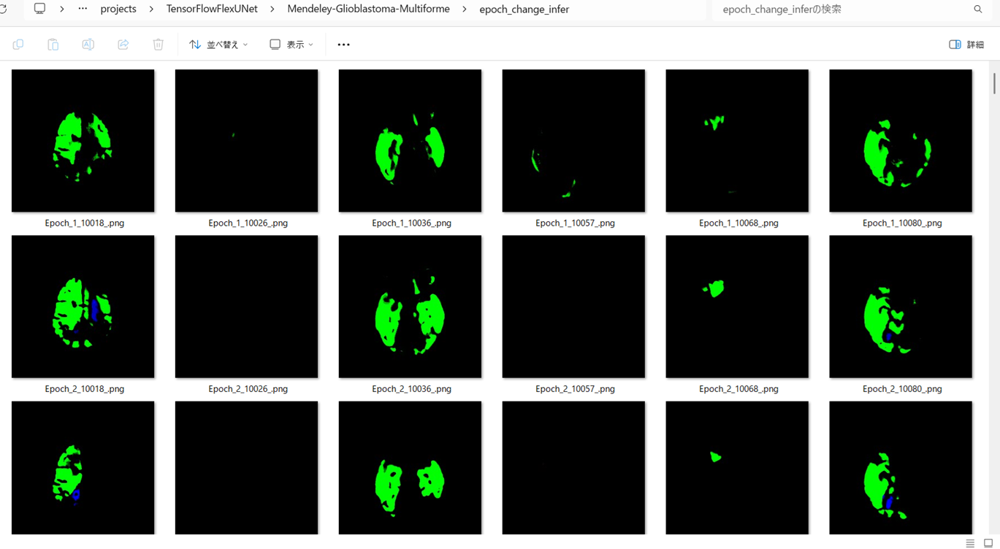 
 
<b>Epoch_change_inference output at middlepoint (epoch 28,29,30)</b> 
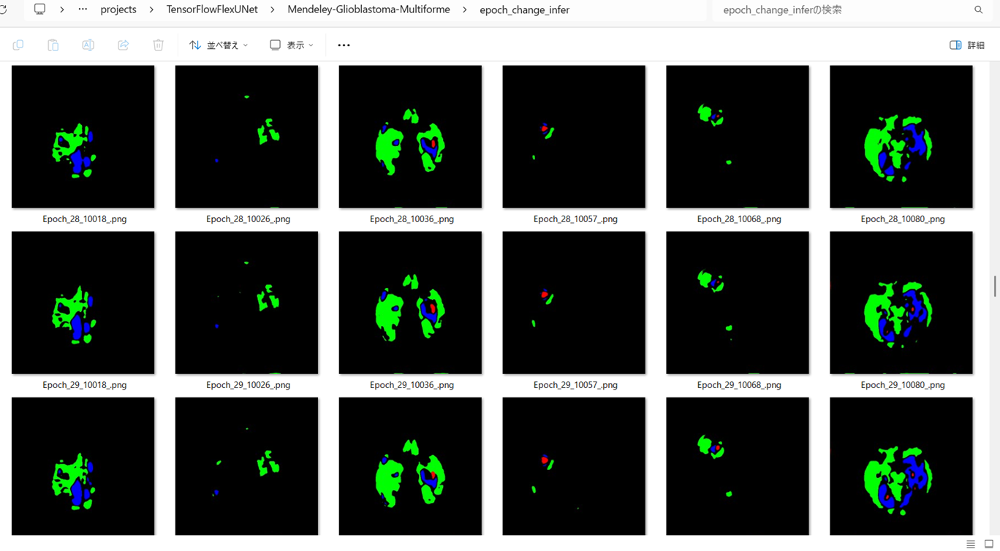 
 
<b>Epoch_change_inference output at ending (epoch 58,59,60)</b> 
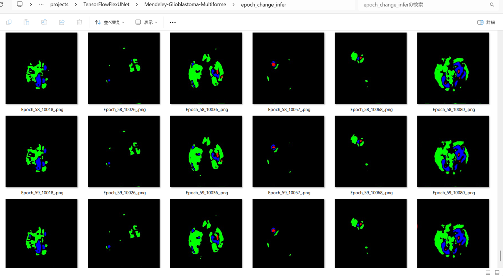 
 
In this experiment, the training process was terminated at epoch 60.  
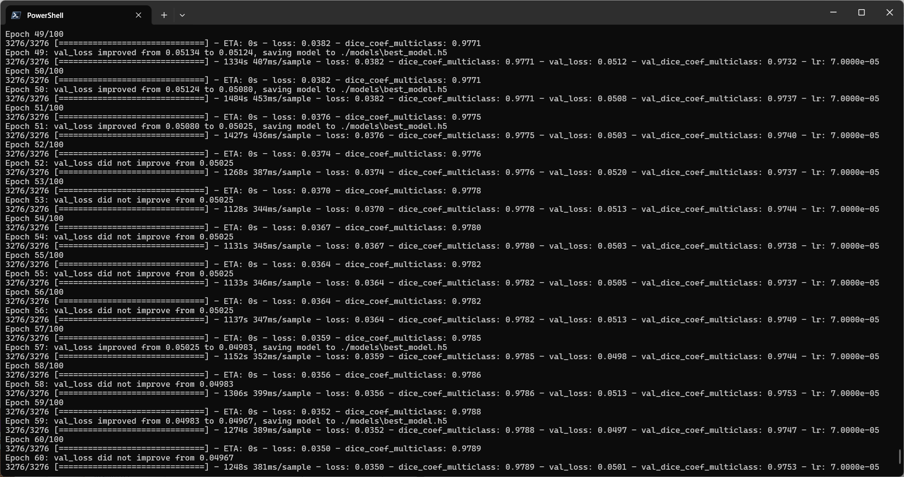 
 
<a href="./projects/TensorFlowFlexUNet/Mendeley-Glioblastoma-Multiforme/eval/train_metrics.csv">train_metrics.csv</a> 
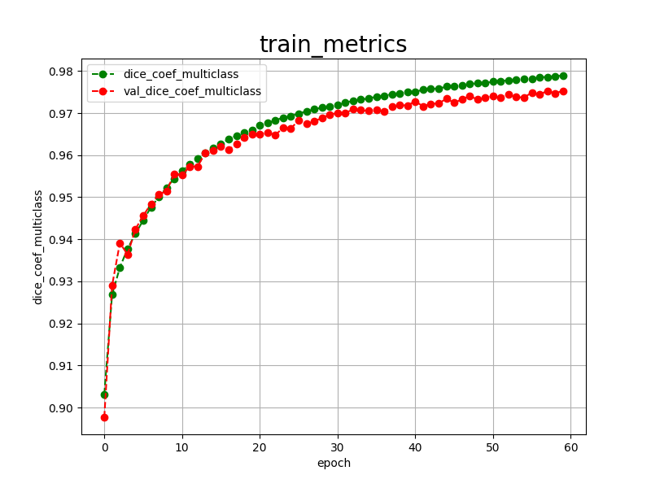 
 
<a href="./projects/TensorFlowFlexUNet/Mendeley-Glioblastoma-Multiforme/eval/train_losses.csv">train_losses.csv</a> 
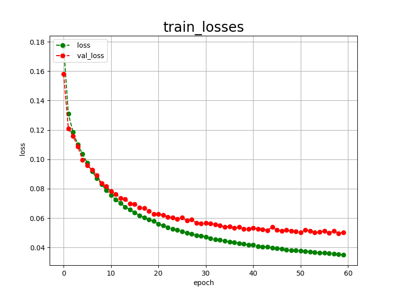
 
<h3>
4 Evaluation
</h3>
Please move to <b>./projects/TensorFlowFlexUNet/Mendeley-Glioblastoma-Multiforme</b> folder, 
and run the following bat file to evaluate TensorFlowUNet model for Mendeley-Glioblastoma-Multiforme. 
<pre>
>./2.evaluate.bat
</pre>
This bat file simply runs the following command.
<pre>
>python ../../../src/TensorFlowFlexUNetEvaluator.py ./train_eval_infer_aug.config
</pre>
Evaluation console output: 
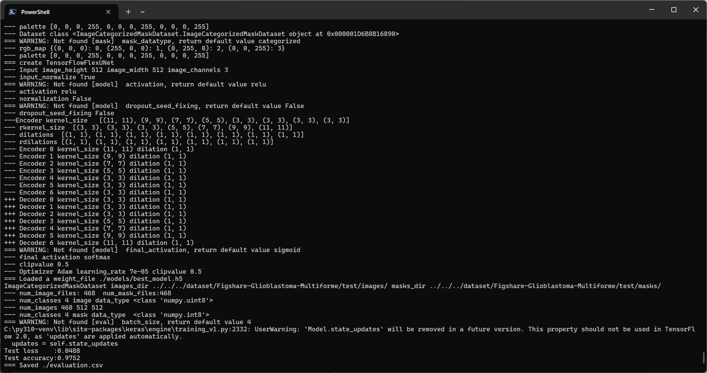
  Image-Segmentation-Mendeley-Glioblastoma-Multiforme
<a href="./projects/TensorFlowFlexUNet/Mendeley-Glioblastoma-Multiforme/evaluation.csv">evaluation.csv</a> 
The loss (categorical_crossentropy) to this <b>Mendeley-Glioblastoma-Multiforme/test</b> was not so low, 
and dice_coef_multiclass not high as shown below.
 
<pre>
categorical_crossentropy,0.0488
dice_coef_multiclass,0.9752
</pre>
 
<h3>
5 Inference
</h3>
Please move to a <b>./projects/TensorFlowFlexUNet/Mendeley-Glioblastoma-Multiforme</b> folder, and run the following bat file to infer segmentation regions for images by the Trained-TensorFlowUNet model for Mendeley-Glioblastoma-Multiforme. 
<pre>
>./3.infer.bat
</pre>
This simply runs the following command.
<pre>
>python ../../../src/TensorFlowFlexUNetInferencer.py ./train_eval_infer_aug.config
</pre>

<b>mini_test_images</b> 
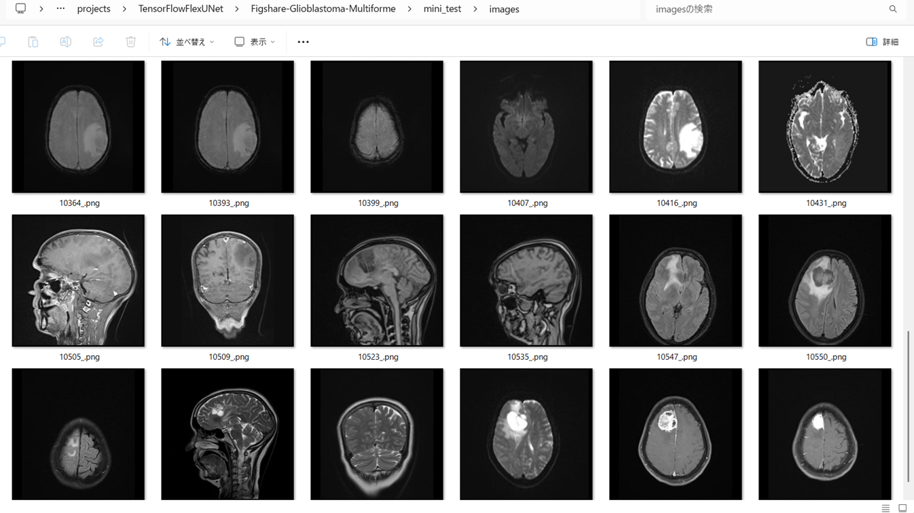 
<b>mini_test_mask(ground_truth)</b> 
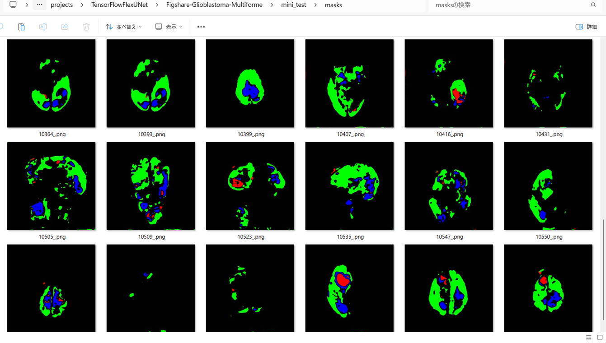 

<b>Inferred test masks</b> 
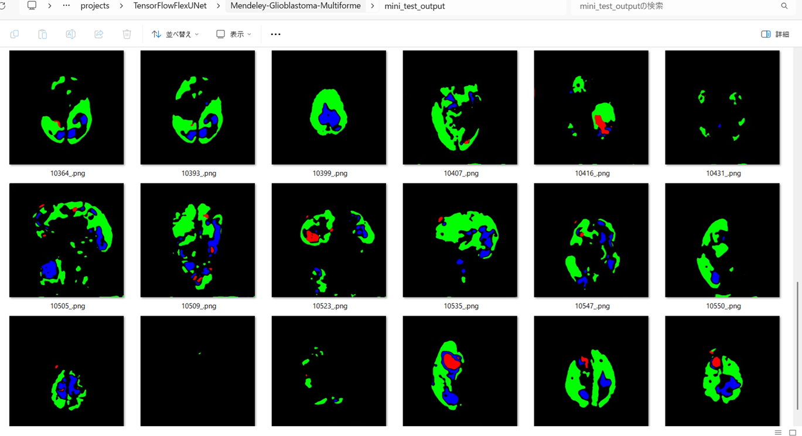 
 

<b>Enlarged images and masks of Mendeley-Glioblastoma-Multiforme Images of 512x512 pixels</b> 
As shown below, the inferred masks predicted by our segmentation model trained by the dataset appear similar to the ,
ground truth masks, but they lack precision in certain areas.
  
<b>class_color_map = {NCR (Necrotic Tumor Core):red, ED (Edema):green, ET (Enhancing Tumor):blue}</b>
  
<table>
<tr>
<th>Input:Image</th>
<th>Mask (ground_truth)</th>
<th>Prediction:Inferred-mask</th>
</tr>
<tr>
<td>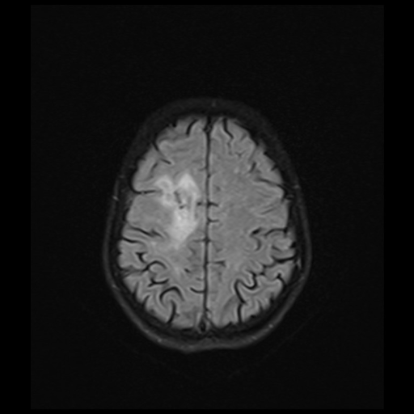</td>
<td>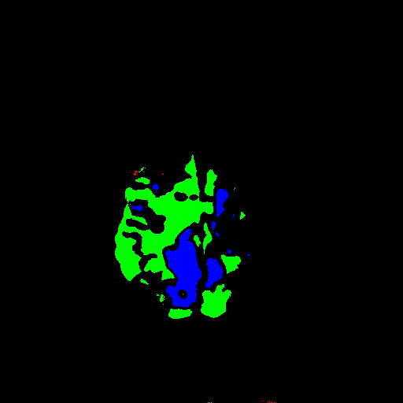</td>
<td>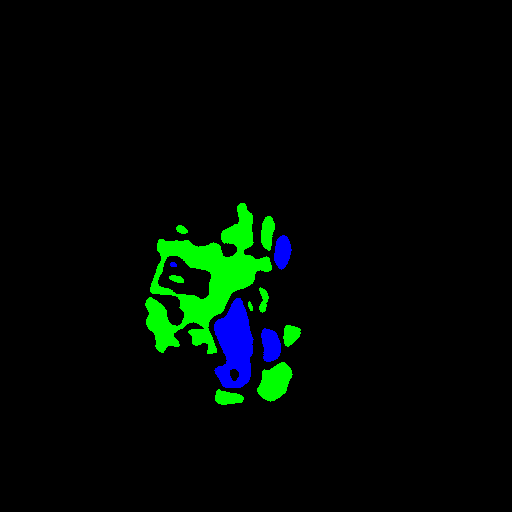</td>
</tr>

<tr>
<td>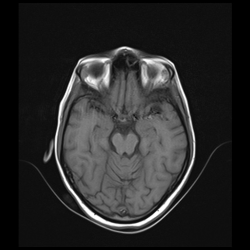</td>
<td>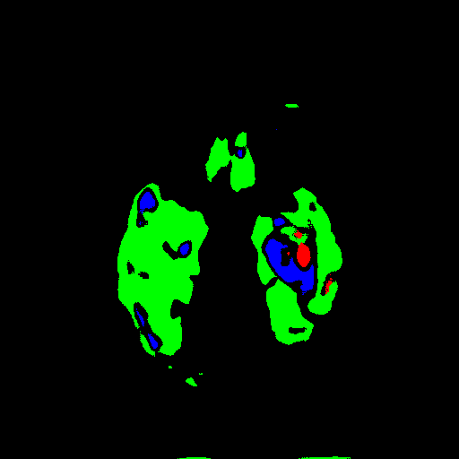</td>
<td>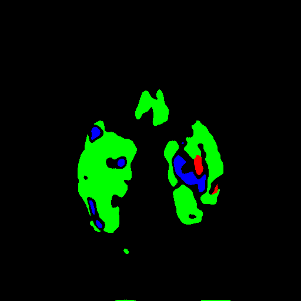</td>
</tr>

<tr>
<td>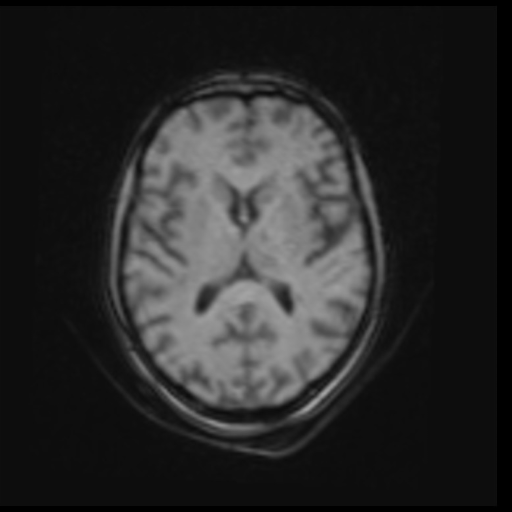</td>
<td>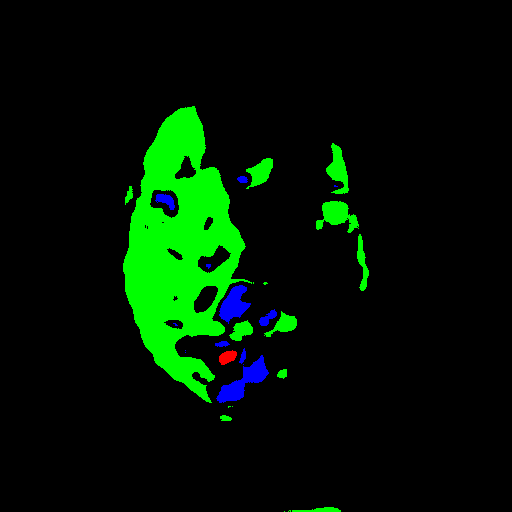</td>
<td>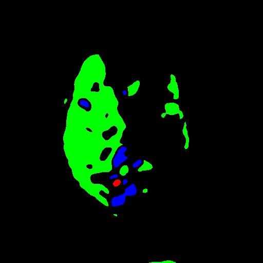</td>
</tr>

<tr>
<td>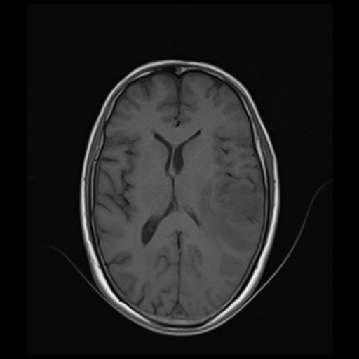</td>
<td>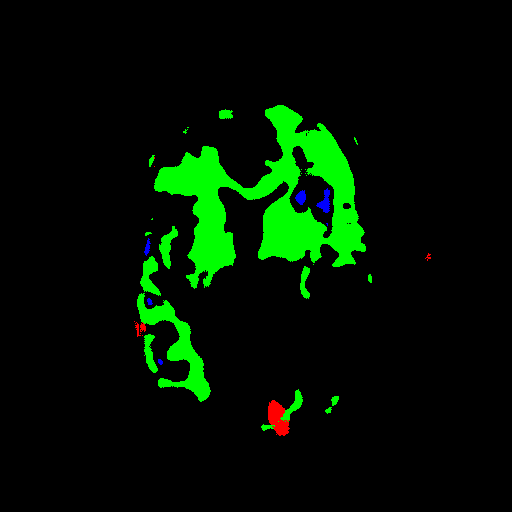</td>
<td>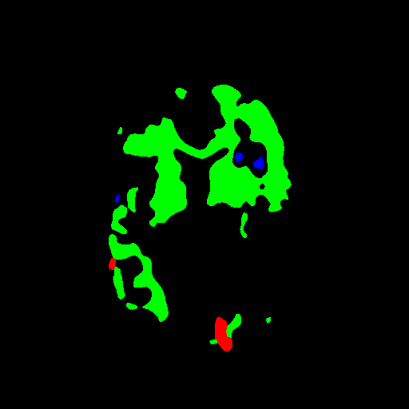</td>
</tr>

<tr>
<td>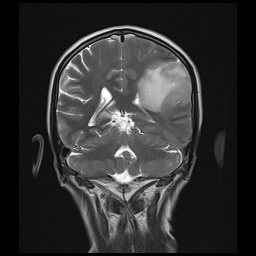</td>
<td>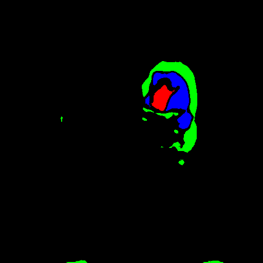</td>
<td>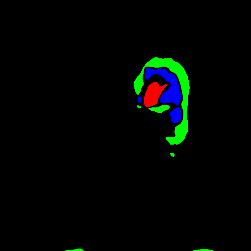</td>
</tr>

<tr>
<td>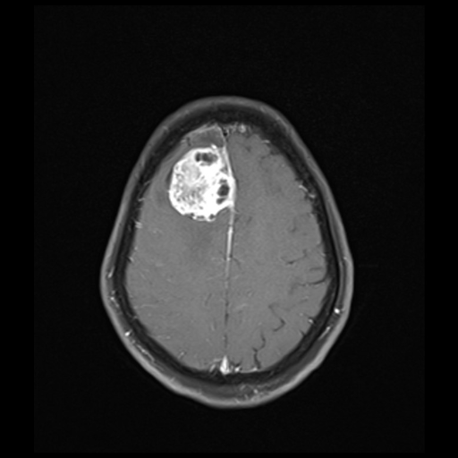</td>
<td>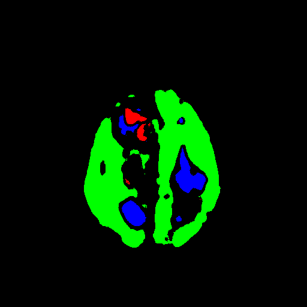</td>
<td>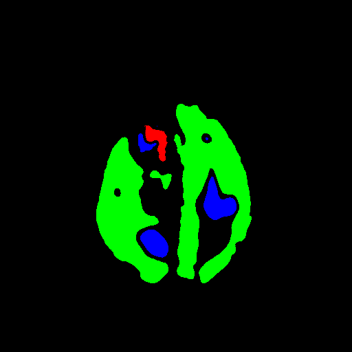</td>
</tr>
</table>

 
<h3>
References
</h3>
<b>1. The Brain Tumor Segmentation (BraTS) Challenge 2023: Glioma Segmentation in Sub-Saharan Africa Patient 
Population (BraTS-Africa)</b> 
Maruf Adewole, Jeffrey D. Rudie, Anu Gbadamosi, Oluyemisi Toyobo, Confidence Raymond, Dong Zhang, 
Olubukola Omidiji, Rachel Akinola, Mohammad Abba Suwaid, Adaobi Emegoakor, Nancy Ojo, Kenneth Aguh,  
Chinasa Kalaiwo, Gabriel Babatunde, Afolabi Ogunleye, Yewande Gbadamosi, Kator Iorpagher, Evan Calabrese, 
Mariam Aboian, Marius Linguraru, Jake Albrecht, Benedikt Wiestler, Florian Kofler, Anastasia Janas, 
Dominic LaBella, Anahita Fathi Kzerooni, Hongwei Bran Li, Juan Eugenio Iglesias, Keyvan Farahani,  
James Eddy, Timothy Bergquist, Verena Chung, Russell Takeshi Shinohara, Walter Wiggins, Zachary Reitman, 
Chunhao Wang, Xinyang Liu, Zhifan Jiang, Ariana Familiar, Koen Van Leemput, Christina Bukas, Maire Piraud, 
Gian-Marco Conte, Elaine Johansson, Zeke Meier, Bjoern H Menze, Ujjwal Baid, Spyridon Bakas, Farouk Dako, 
Abiodun Fatade, Udunna C Anazodo 
<a href="https://arxiv.org/pdf/2305.19369">https://arxiv.org/pdf/2305.19369</a>
  
<b>2. Advancing Precision: A Comprehensive Review of MRI Segmentation Datasets from BraTS Challenges (2012–2025)</b> 
Beatrice Bonato, Loris Nanni and Alessandra Bertoldo 
<a href="https://www.mdpi.com/1424-8220/25/6/1838">https://www.mdpi.com/1424-8220/25/6/1838</a>
  
<b>3. Multi-class glioma segmentation on real-world data with missing MRI sequences: comparison of three deep learning algorithms
</b> 
Hugh G. Pemberton, Jiaming Wu, Ivar Kommers, Domenique M. J. Müller, Yipeng Hu, Olivia Goodkin,  
Sjoerd B. Vos, Sotirios Bisdas, Pierre A. Robe, Hilko Ardon, Lorenzo Bello, Marco Rossi,  
Tommaso Sciortino, Marco Conti Nibali, Mitchel S. Berger, Shawn L. Hervey-Jumper, Wim Bouwknegt, 
Wimar A. Van den Brink, Julia Furtner, Seunggu J. Han, Albert J. S. Idema, Barbara Kiesel, 
Georg Widhalm, Alfred Kloet, Michiel Wagemakers, Aeilko H. Zwinderman, Sandro M. Krieg,  
Emmanuel Mandonnet, Ferran Prados, Philip de Witt Hamer, Frederik Barkhof & Roelant S. Eijgelaar 
<a href="https://www.nature.com/articles/s41598-023-44794-0">
https://www.nature.com/articles/s41598-023-44794-0
</a>
  
<b>4. Training 3D U-Net for Brain Tumor Segmentation Challenge – Medical Imaging</b> 
Jaykumaran 
<a href="https://learnopencv.com/3d-u-net-brats/">https://learnopencv.com/3d-u-net-brats/</a>
  
<b>5. TensorFlow-FlexUNet-Image-Segmentation-UTSW-Glioma-T2W-Subset</b> 
Toshiyuki Arai 
<a href="https://github.com/sarah-antillia/TensorFlow-FlexUNet-Image-Segmentation-UTSW-Glioma-T2W-Subset">
https://github.com/sarah-antillia/TensorFlow-FlexUNet-Image-Segmentation-UTSW-Glioma-T2W-Subset
</a>
  
<b>6. TensorFlow-FlexUNet-Image-Segmentation-Multiclass-BraTS2023-Subset</b> 
Toshiyuki Arai 
<a href="https://github.com/sarah-antillia/TensorFlow-FlexUNet-Image-Segmentation-Multiclass-BraTS2023-Subset">
https://github.com/sarah-antillia/TensorFlow-FlexUNet-Image-Segmentation-Multiclass-BraTS2023-Subset
</a>
  
<b>7. TensorFlow-FlexUNet-Image-Segmentation-Multiclass-BraTS2020</b> 
Toshiyuki Arai 
<a href="https://github.com/sarah-antillia/TensorFlow-FlexUNet-Image-Segmentation-Multiclass-BraTS2020">
https://github.com/sarah-antillia/TensorFlow-FlexUNet-Image-Segmentation-Multiclass-BraTS2020
</a>
  
<b>8. TensorFlow-FlexUNet-Image-Segmentation-Brain-Tumor-BraTS2019-HGG-LGG-MRI</b> 
Toshiyuki Arai 
<a href="https://github.com/sarah-antillia/TensorFlow-FlexUNet-Image-Segmentation-Brain-Tumor-BraTS2019-HGG-LGG-MRI">
https://github.com/sarah-antillia/TensorFlow-FlexUNet-Image-Segmentation-Brain-Tumor-BraTS2019-HGG-LGG-MRI
</a>
  
<b>9. TensorFlow-FlexUNet-Image-Segmentation-Model</b> 
Toshiyuki Arai  
<a href="https://github.com/sarah-antillia/TensorFlow-FlexUNet-Image-Segmentation-Model">
https://github.com/sarah-antillia/TensorFlow-FlexUNet-Image-Segmentation-Model
</a>
 
 
